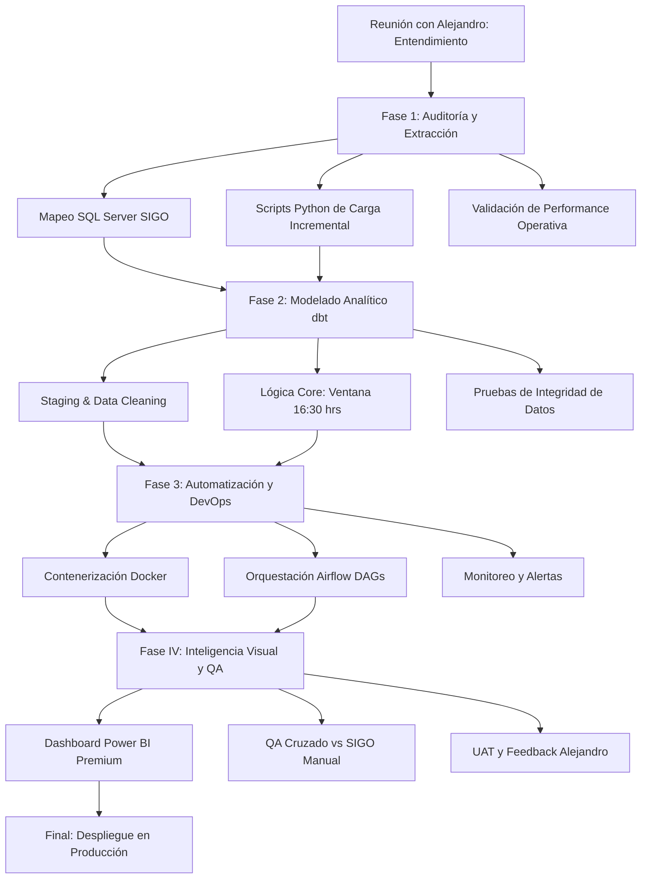

# Plan de Trabajo: Dashboard Solicitudes por Cliente (US4937)
**Responsable:** Ing. Sebastian Posada

Este documento representa la hoja de ruta definitiva del requerimiento US4937. Se ha diseñado bajo un enfoque de ingeniería de datos de alta fidelidad.

## 1. Roadmap Estratégico (MapTree End-to-End)

## 2. Explicación Detallada de las Etapas

### Fase 0: Descubrimiento y Alineación
Esta etapa es el corazón del proyecto. No se trata solo de escuchar, sino de **traducir la necesidad de negocio a lógica técnica**. Aquí definimos qué significa realmente una solicitud "Adicional" y cómo Alejandro y su equipo toman decisiones basadas en los números que verán. Si esta base no es sólida, el código posterior no servirá de nada.

### Fase 1: Arquitectura de Extracción (Data Ingestion)
Aquí es donde "ensuciamos las manos" con las bases de datos de SIGO. El reto no es solo traer datos, sino hacerlo de forma que **no interrumpamos la operación diaria de Comsatel**. Implementamos scripts de Python que extraen incrementalmente, asegurando que solo traigamos lo nuevo y lo actualizado, optimizando los tiempos de respuesta.

### Fase 2: Ingeniería de Transformación (dbt)
En esta fase convertimos el "pantano de datos" en una "fuente de verdad". Usamos **dbt (data build tool)** para que cada regla de negocio, especialmente la compleja lógica de las 16:30 hrs, esté escrita en código reproducible, versionado y testeado. Aquí es donde la data cruda adquiere significado para el área operativa.

### Fase 3: Orquestación de Flujos (DevOps/DataOps)
Un dashboard que no se actualiza es un dashboard muerto. Configuramos **Apache Airflow** para que sea el "director de orquesta", ejecutando las tareas cada 2 horas sin fallos. Si algo sale mal (un corte de luz o red), Airflow se encarga de re-intentar y notificarnos inmediatamente para que nosotros no tengamos que estar vigilando la pantalla.

### Fase 4: Entrega Visual y QA (Business Intelligence)
La última milla del proyecto. Creamos visuales en **Power BI** que hablen por sí solos. No solo ponemos números; diseñamos una experiencia de usuario donde Alejandro pueda detectar cuellos de botella en segundos. El QA (Garantía de Calidad) es obsesivo: cada cifra del dashboard se cruza contra registros manuales para garantizar confianza total.

## 3. Listado de Tareas y Tiempos Estimados

| ID | Tarea Detallada | Descripción del Esfuerzo | Tiempo Est. |
|:---|:---|:---|:---|
| **0.0** | **Fase Inicial: Descubrimiento** | | **h** |
| 0.1 | Sesión de Entendimiento con Alejandro | Mapeo de reglas de negocio y definición de KPIs críticos. | 2.5 - 3.0h |
| **1.0** | **Arquitectura de Extracción** | | **h** |
| 1.1 | Mapeo detallado de tablas SQL Server | Localización física de campos de fecha y estados en SIGO. | 4.0h |
| 1.2 | Desarrollo de script Python Incremental | Lógica para traer solo novedades y evitar sobrecarga de BD. | 9.0h |
| 1.3 | Configuración de Bóveda de Secretos | Manejo seguro de credenciales (Variables de entorno). | 3.0h |
| 1.4 | Pruebas de conectividad VPN/Red | Asegurar estabilidad de la extracción en horario pico. | 4.5h |
| 1.5 | Auditoría de tipos de datos origen | Verificar que los campos `datetime` tengan precisión total. | 4.5h |
| 1.6 | Implementación de logs de extracción | Registro de éxitos y fallos para trazabilidad humana. | 4.5h |
| **2.0** | **Ingeniería dbt Avanzada** | | **h** |
| 2.1 | Configuración de dbt Sources & YAMLs | Definición de metadatos y documentación de columnas. | 3.0h |
| 2.2 | Creación de modelos de Staging | Limpieza de nulos, estandarización de strings y fechas. | 9.0h |
| 2.3 | Lógica core de Ventana de Corte (16:30) | Implementación de lógica temporal multi-día para "Adicionales". | 7.0h |
| 2.4 | Modelos de Interfaz (Marts) | Tablas finales preparadas para el consumo del dashboard. | 6.0h |
| 2.5 | Implementación de dbt Tests | Pruebas automáticas de integridad y valores permitidos. | 8.0h |
| 2.6 | Documentación de linaje de datos | Generar catálogo que explique de dónde viene cada número. | 4.5h |
| 2.7 | Optimización de Vistas SQL | Tuning de consultas para el dashboard. | 4.5h |
| **3.0** | **Automatización y Operación** | | **h** |
| 3.1 | Setup de Contenedores Docker | Preparación del entorno aislado para despliegue. | 4.5h |
| 3.2 | Desarrollo de DAGs en Airflow | Programación de la lógica de re-intento y dependencias. | 9.0h |
| 3.3 | Configuración de Webhooks de Alerta | Notificaciones a Email ante fallos en la cadena. | 6.0h |
| 3.4 | Cronograma de limpieza de temporales | Tarea para mantener el disco limpio de archivos muertos. | 3.0h |
| 3.5 | Pruebas de "Full Refresh" | Validar recuperación total ante un fallo catastrófico. | 4.5h |
| 3.6 | Documentación técnica de despliegue | Cómo volver a prender todo si se apaga el servidor. | 4.5h |
| **4.0** | **Visualización y QA** | | **h** |
| 4.1 | Maquetado UI/UX en Power BI | Diseño de tarjetas, filtros dinámicos y gráficos Gantt. | 12.0h |
| 4.2 | Implementación de DAX optimizado | Medidas calculadas que no realicen consultas pesadas. | 7.5h |
| 4.3 | QA de Conciliación Manual (SIGO) | Sesión de cruce de datos real vs dashboard (Cero errores). | 7.5h |
| 4.4 | Ajustes de Diseño (Colores Comsatel) | Darle el look & feel profesional de la compañía. | 4.5h |
| 4.5 | Capacitación de Usuario Final | Sesión para que los usuarios aprendan a sacar provecho al tablero. | 4.0h |
| 4.6 | Firma de Aceptación y Cierre | Entrega formal del requerimiento US4937. | 1.5h |

**Total Esfuerzo:**  Horas  
