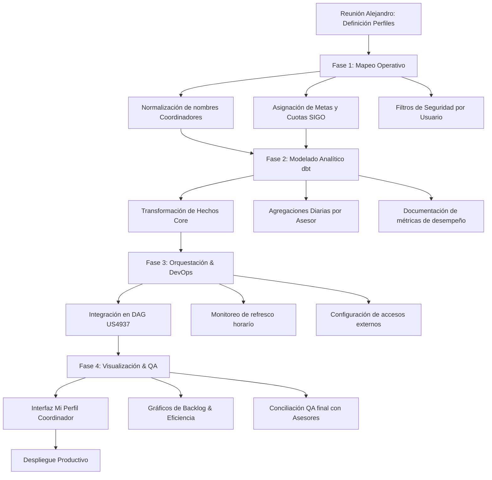

# Plan de Trabajo Maestro: Dashboard Resumen por Coordinador (US4938)
**Responsable:** Ing. Sebastian Posada

Enfoque técnico detallado para empoderar a los coordinadores de Comsatel con visibilidad en tiempo real sobre su gestión diaria.

## 1. Roadmap Estratégico (MapTree End-to-End)

## 2. Explicación Detallada de las Etapas

### Fase 0: Definición de Identidad y Metas
Aquí alineamos el sistema con las personas. No todos los coordinadores se llaman igual en SIGO que en la nómina, y no todos tienen las mismas metas. En la reunión con Alejandro definimos esa matriz de coordinación para que cuando Jorge Balarezo abra el dashboard, vea **su realidad**, no la de otro.

### Fase 1: Normalización y Seguridad (Data Governance)
Es el trabajo "invisible" pero vital. Si un nombre de coordinador tiene un acento en una tabla y en otra no, el dashboard fallará. Aquí normalizamos todo a un estándar único. Además, definimos quién puede ver qué, asegurando que la información de gestión sea manejada con la privacidad y el rigor correctos.

### Fase 2: Ingeniería dbt (Custom Logic)
Adaptamos el motor dbt para que ya no solo piense en "solicitudes", sino en "responsables". Creamos métricas específicas de "Atención por Coordinador", diferenciando claramente lo que cada uno tenía programado vs lo que le cayó "de sorpresa" (adicionales). Es pura lógica de eficiencia operativa.

### Fase 3: Integración de Pipelines (DataOps)
Aprovechamos la infraestructura ya montada en US4937. No creamos un sistema nuevo, sino que expandimos el existente. Airflow ahora tendrá una tarea más: procesar los reportes individuales. Esto ahorra costos de servidor y nos da una visión centralizada de todo el producto SIGO.

### Fase 4: UX Personalizada y Control de Calidad
Aquí es donde el coordinador se enamora de la herramienta. Diseñamos una interfaz donde lo primero que vea sean sus KPIs críticos de hoy. La etapa de QA es interactiva: nos sentamos con un coordinador real para ver si los números que le arroja el sistema coinciden con lo que él tiene en su WhatsApp o Excel manual.

## 3. Listado de Tareas y Tiempos Estimados

| ID | Tarea Detallada | Descripción del Esfuerzo | Tiempo Est. |
|:---|:---|:---|:---|
| **0.0** | **Fase Inicial: Descubrimiento** | | **3.0h** |
| 0.1 | Sesión Estratégica con Alejandro | Definición de cuotas, asesores y reglas de asignación. | 3.0h |
| **1.0** | **Mapeo y Gobernanza de Datos** | | **31.5h** |
| 1.1 | Limpieza Profunda de Nombres (Master Data) | Unificar identidades de coordinadores entre tablas SIGO. | 6.0h |
| 1.2 | Configuración de Metas vs Logros | Creación de tabla maestra con cuotas diarias esperadas. | 9.0h |
| 1.3 | Análisis de jerarquías operativas | Mapear quién reporta a quién para drill-downs gerenciales. | 4.5h |
| 1.4 | Implementación de catálogos de servicio | Unificar tipos (Instalación/Retiro) para todos los usuarios. | 3.0h |
| 1.5 | Auditoría de campos de "Coordinador" | Detectar registros con campos vacíos o mal asignados. | 4.5h |
| 1.6 | Setup de roles de usuario en BD | Preparar la seguridad para el acceso individualizado. | 4.5h |
| **2.0** | **Modelado dbt Analítico** | | **45.0h** |
| 2.1 | Refactorización de `fct_solicitudes` | Adaptar lógica core para segmentación por responsable. | 9.0h |
| 2.2 | Creación de modelos de agregación diaria | Pre-calcular totales para que el dashboard cargue al instante. | 12.0h |
| 2.3 | Modelado de tabla "Backlog Activo" | Lógica para ver qué solicitudes están "quedadas" hoy. | 6.0h |
| 2.4 | Implementación de Unit Tests en dbt | Validar que un coordinador no pueda tener "negativos". | 6.0h |
| 2.5 | Documentación técnica de métricas | Explicar mediante código qué es una "Solicitud Atendida". | 4.5h |
| 2.6 | Generación de vistas para Power BI | Exponer los datos de forma limpia y performante. | 4.5h |
| 2.7 | Optimización de joins entre tablas | Reducir el tiempo de ejecución en dbt para refresco horarío. | 3.0h |
| **3.0** | **Orquestación y Despliegue** | | **25.5h** |
| 3.1 | Expansión de DAGs en Airflow | Añadir las nuevas tareas de coordinadores al flujo SIGO. | 6.0h |
| 3.2 | Pruebas de concurrencia de carga | Validar que 10+ coordinadores puedan consultar a la vez. | 4.5h |
| 3.3 | Configuración de Logs por Proceso | Saber exactamente si falló el reporte de un área específica. | 4.5h |
| 3.4 | Setup de backups de metadatos | Respaldo de las tablas de metas y cuotas manuales. | 3.0h |
| 3.5 | Monitoreo de latencia de refresco | Asegurar que la data nueva aparezca en menos de 5 min. | 3.0h |
| 3.6 | Ajustes de seguridad en el Gateway | Garantizar túnel seguro entre local y Power BI Service. | 4.5h |
| **4.0** | **Dashboard & QA Participativo** | | **34.5h** |
| 4.1 | UI/UX "Mi Perfil por Coordinador" | Interfaz tipo cockpit con KPIs de cumplimiento individual. | 9.0h |
| 4.2 | Implementación de Filtros de Usuario | Slicers inteligentes que auto-detectan al coordinador. | 6.0h |
| 4.3 | QA de Conciliación con Asesores Reales | Prueba de fuego con el equipo de Alejandro. | 6.0h |
| 4.4 | Ajustes de Feedback Visual | Mejorar colores y tamaños según uso en dispositivos móviles. | 4.5h |
| 4.5 | Manual de Usuario "Self-Service" | Guía en PDF para que los coordinadores se auto-sirvan la data. | 3.0h |
| 4.6 | Sesión de cierre con firma de Alejandro | Validación final del alcance del requerimiento US4938. | 6.0h |

**Total Esfuerzo:** 139.5 Horas Hombre 
