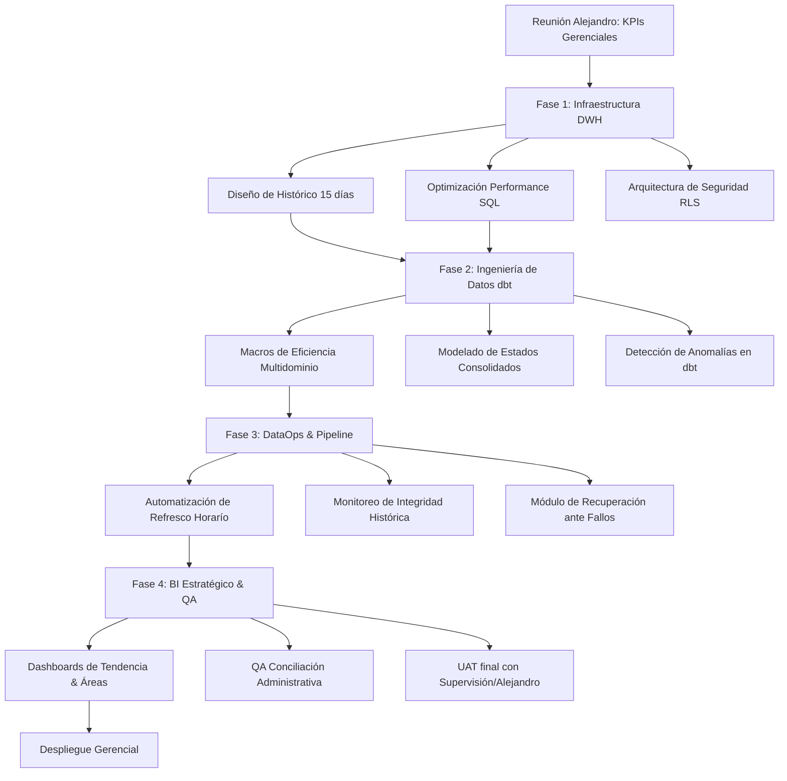

# Plan de Trabajo Maestro: Dashboard Estado General de Solicitudes (US4939)
**Responsable:** Ing. Sebastian Posada

Visión holística y estratégica para el control total de las operaciones de servicios en Comsatel. Un proyecto de alta jerarquía analítica.

## 1. Roadmap Estratégico (MapTree End-to-End)

## 2. Explicación Detallada de las Etapas

### Fase 0: Definición de la Métrica Maestra
En esta fase con Alejandro, decidimos qué es el "éxito" para la compañía. ¿Una solicitud cancelada cuenta en la eficiencia? ¿Cómo medimos la productividad entre Instalaciones y Retiros sin comparar "peras con manzanas"? Aquí establecemos las reglas del juego para la alta gerencia.

### Fase 1: Ingeniería de Almacenamiento (DWH Design)
Para analizar tendencias de 15 días, no podemos cargar la base operativa cada vez. Diseñamos un pequeño **Data Warehouse (DWH)** que guarda la historia. El foco aquí es la velocidad; queremos que un reporte gerencial cargue en menos de 2 segundos, por lo que aplicamos técnicas de indexado y particionado avanzado.

### Fase 2: Inteligencia Distribuida (dbt Macros)
Usamos el poder de dbt para crear "fórmulas maestras". Desarrollamos macros que calculan la eficiencia de forma uniforme para cualquier tipo de servicio. Si mañana Alejandro quiere añadir un cuarto tipo de servicio, el sistema estará listo para integrarlo en minutos gracias a este diseño modular.

### Fase 3: Seguridad y Continuidad (Data Pipeline)
Un reporte gerencial debe ser infalible y seguro. Implementamos **Row Level Security (RLS)** para que la información sensible solo sea vista por quien tiene autorización. Además, blindamos el pipeline: si el servidor de SIGO se cae, nuestro DWH mantendrá la última información disponible para no dejar a la gerencia "a ciegas".

### Fase 4: Storytelling de Datos y QA Administrativo
No hacemos cuadros, contamos historias. El dashboard se diseña para mostrar tendencias: ¿Subió la demanda de mantenimientos este martes? ¿Por qué? El QA en esta fase es administrativo; cruzamos los totales con lo que finanzas o contabilidad tienen registrado para asegurar que la analítica sea la base de la verdad financiera.

## 3. Listado de Tareas y Tiempos Estimados

| ID | Tarea Detallada | Descripción del Esfuerzo | Tiempo Est. |
|:---|:---|:---|:---|
| **0.0** | **Fase Inicial: Descubrimiento** | | **3.0h** |
| 0.1 | Sesión de Definición Estratégica con Alejandro | Definición de KPIs macro y niveles de acceso gerencial. | 3.0h |
| **1.0** | **Arquitectura de Alta Disponibilidad** | | **39.0h** |
| 1.1 | Diseño de Tabla de Hechos Histórica | Estructura para almacenamiento de tendencias de 15+ días. | 9.0h |
| 1.2 | Tuning y Optimización de Queries SQL | Refactorizar consultas pesadas para reducir consumo de CPU. | 9.0h |
| 1.3 | Implementación de Series de Tiempo (Spines) | Garantizar que los gráficos no tengan "huecos" en días sin data. | 6.0h |
| 1.4 | Auditoría de integridad referencial | Validar que cada servicio tenga cliente y estado asignado. | 4.5h |
| 1.5 | Configuración de Capa de Seguridad RLS | Definir los roles de acceso en la base de datos (Postgres/DuckDB). | 6.0h |
| 1.6 | Setup de Entorno de Pruebas (Staging) | Crear espejo de la realidad para testear cambios sin riesgo. | 4.5h |
| **2.0** | **Modelado dbt Senior** | | **51.0h** |
| 2.1 | Desarrollo de Macros de Eficiencia | SQL dinámico para cálculos de ratios transversales. | 9.0h |
| 2.2 | Modelos de Estados Consolidados | Unificar Instalaciones, Mantenimientos y Retiros en una vista. | 15.0h |
| 2.3 | Lógica de Detección de Anomalías | Alerta temprana si el volumen de solicitudes cae bruscamente. | 9.0h |
| 2.4 | Implementación de dbt Snapshot | Guardar la historia de cambios de estado de una solicitud. | 6.0h |
| 2.5 | Test de volumen y umbrales | Validar que los datos cargados estén en rangos normales. | 4.5h |
| 2.6 | Generación de catálogo de datos | Diccionario que explique cada KPI a los directivos. | 4.5h |
| 2.7 | Refactor de modelos US4937/38 | Integrar lógicas previas para evitar duplicidad de código. | 3.0h |
| **3.0** | **Orquestación y Monitoreo Proactivo** | | **28.5h** |
| 3.1 | Implementación de DAGs Gerenciales | Flujo de Airflow optimizado para reportes de alta jerarquía. | 6.0h |
| 3.2 | Configuración de Logs de Auditoría | Quién accedió a la data y cuándo (Cumplimiento de seguridad). | 4.5h |
| 3.3 | Módulo de recuperación automática | Scripts para re-procesar días fallidos sin intervención manual. | 6.0h |
| 3.4 | Monitoreo de salud de la conexión SIGO | Alerta de latencia excesiva en la extracción de datos. | 4.5h |
| 3.5 | Dashboard de monitoreo interno | Vista rápida para el desarrollador sobre el estado del pipeline. | 3.0h |
| 3.6 | Configuración de backups en la nube | Copia de seguridad del DWH analítico cada 24h. | 4.5h |
| **4.0** | **Dashboards Gerenciales y QA** | | **43.5h** |
| 4.1 | Diseño de Tablero de Tendencias | Visualización de áreas y líneas comparativas (Hoy vs Ayer). | 15.0h |
| 4.2 | Implementación de Drill-Downs | Permitir pasar de la vista "Macro" al detalle de una solicitud. | 7.5h |
| 4.3 | QA de Conciliación Administrativa | Validar contra reportes de finanzas la veracidad del volumen. | 9.0h |
| 4.4 | Testing de Seguridad por Rol | Validar que cada usuario solo vea su información permitida. | 4.5h |
| 4.5 | Guía Ejecutiva de Uso | Manual de 1 página para que los directivos operen el dashboard. | 3.0h |
| 4.6 | Sesión de cierre con firma de Alejandro | Entrega final del ecosistema SIGO US4937/US4938/US4939. | 4.5h |

**Total Esfuerzo:** 165 Horas Hombre 
